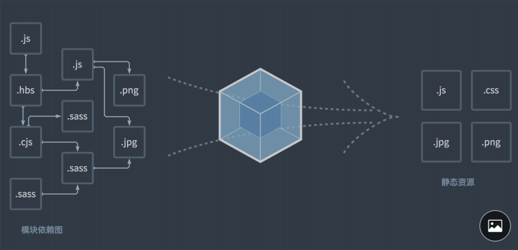
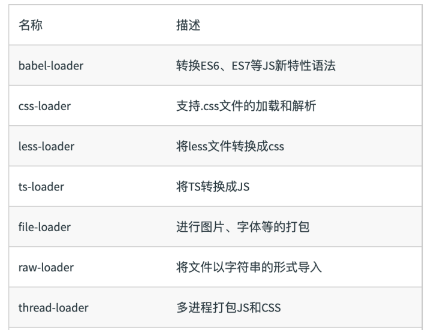
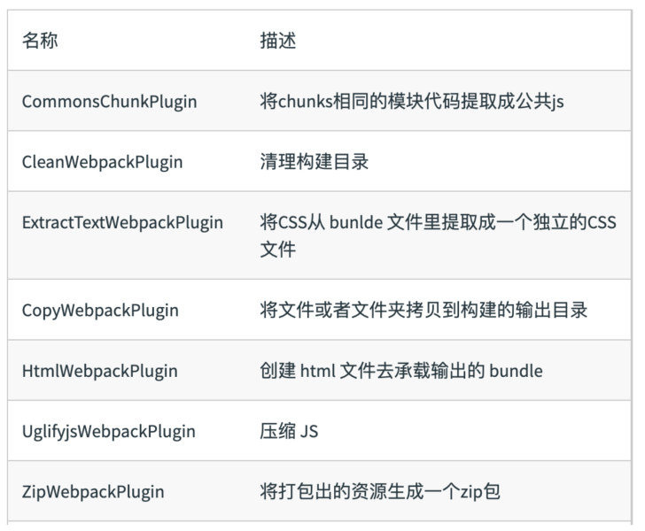
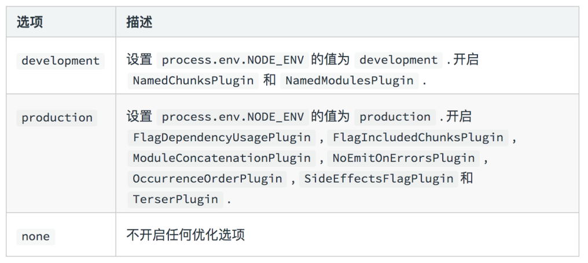
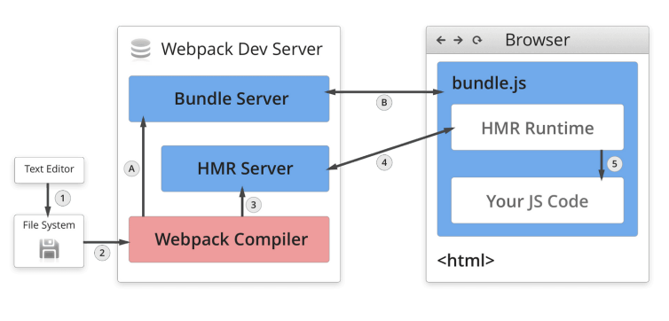
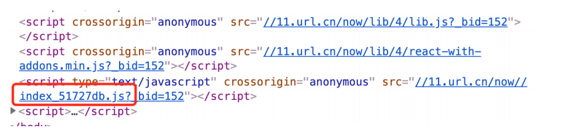

<!--
 * @Author: your name
 * @Date: 2019-11-29 15:19:45
 * @LastEditTime: 2019-11-29 16:17:42
 * @LastEditors: Please set LastEditors
 * @Description: In User Settings Edit
 * @FilePath: \interview\6、webpack\chapter2\README.md
 -->

## 基础篇：webpack 基础⽤法

### 核⼼概念之 Entry

Entry ⽤来指定 webpack 的打包⼊⼝

### 理解依赖图的含义



依赖图的⼊⼝是 entry

对于⾮代码⽐如图⽚、字体依赖也会不断加⼊到依赖图中

### Entry 的⽤法

单⼊⼝：entry 是⼀个字符串

```javascript
module.exports = {
  entry: "./path/to/my/entry/file.js"
};
```

多⼊⼝：entry 是⼀个对象

```javascript
module.exports = {
  entry: {
    app: "./src/app.js",
    adminApp: "./src/adminApp.js"
  }
};
```

### 核⼼概念之 Output

Output ⽤来告诉 webpack 如何将编译后的⽂件输出到磁盘

### Output 的⽤法：单⼊⼝配置

```javascript
module.exports = {
    entry: './path/to/my/entry/file.js'
    output: {
    filename: 'bundle.js’,
    path: __dirname + '/dist'
  }
};
```

### Output 的⽤法：多⼊⼝配置

```javascript
module.exports = {
  entry: {
    app: "./src/app.js",
    search: "./src/search.js"
  },
  output: {
    // 通过占位符确保⽂件名称的唯⼀
    filename: "[name].js",
    path: __dirname + "/dist"
  }
};
```

### 核⼼概念之 Loaders

webpack 开箱即用只支持 JS 和 JSON 两种文件类型，通过 Loaders 去支持其它文件类型并且把它们转化成有效的模块，并且可以添加到依赖图中。本身是一个函数，接受源文件作为参数，返回转换的结果。

### 常⻅的 Loaders 有哪些？



### Loaders 的⽤法

- test 指定匹配规则
- use 指定使⽤的 loader 名称

```javascript
const path = require("path");
module.exports = {
  output: {
    filename: "bundle.js"
  },
  module: {
    rules: [{ test: /\.txt$/, use: "raw-loader" }]
  }
};
```

### 核⼼概念之 Plugins

插件⽤于 bundle ⽂件的优化，资源管理和环境变量注⼊.作⽤于整个构建过程

### 常⻅的 Plugins 有哪些？



### Plugins 的⽤法

```javascript
const path = require("path");
module.exports = {
  output: {
    filename: "bundle.js"
  },
  // 放到 plugins 数组⾥
  plugins: [new HtmlWebpackPlugin({ template: "./src/index.html" })]
};
```

### 核⼼概念之 Mode

Mode ⽤来指定当前的构建环境是：production、development 还是 none。设置 mode 可以使⽤ webpack 内置的函数，默认值为 production

### Mode 的内置函数功能



### 资源解析：解析 ES6

使⽤ babel-loader。babel 的配置⽂件是：.babelrc

```javascript
const path = require("path");
module.exports = {
  entry: "./src/index.js",
  output: {
    filename: "bundle.js",
    path: path.resolve(__dirname, "dist")
  },
  + module: {
  +   rules: [
  +     {
  +       test: /\.js$/,
  +       use: "babel-loader"
  +     }
  +   ]
  + }
};
```

### 资源解析：增加 ES6 的 babel preset 配置

```javascript
{
  "presets": [
    // 增加 ES6 的 babel preset 配置
  +  "@babel/preset-env"
  ],
  "plugins": [
    "@babel/proposal-class-properties"
  ]
}
```

### 资源解析：解析 React JSX

```javascript
{
  "presets": [
    "@babel/preset-env",
    // 增加 React 的 babel preset 配置
  + "@babel/preset-react"
  ],
  "plugins": [
    "@babel/proposal-class-properties"
  ]
}
```

### 资源解析：解析 CSS

css-loader ⽤于加载 .css ⽂件，并且转换成 commonjs 对象

style-loader 将样式通过 style 标签插⼊到 head 中

```javascript
const path = require("path");
module.exports = {
  entry: "./src/index.js",
  output: {
    filename: "bundle.js",
    path: path.resolve(__dirname, "dist")
  },
+  module: {
+    rules: [
+      {
+        test: /\.css$/,
+        use: ["style-loader", "css-loader"]
+      }
+    ]
+  }
};
```

### 资源解析：解析 Less 和 SaSS

less-loader ⽤于将 less 转换成 css

```javascript
const path = require("path");
module.exports = {
  entry: "./src/index.js",
  output: {
    filename: "bundle.js",
    path: path.resolve(\_\_\_dirname, "dist")
  },
+  module: {
+    rules: [
+      {
+        test: /\.less\$/,
+        use: ["style-loader", "css-loader", " less-loader"]
+      }
+    ]
+  }
};
```

### 资源解析：解析图⽚

file-loader ⽤于处理⽂件

```javascript
const path = require("path");
module.exports = {
  entry: "./src/index.js",
  output: {
    filename: "bundle.js",
    path: path.resolve(__dirname, "dist")
  },
+  module: {
+    rules: [
+      {
+        test: /\.(png|svg|jpg|gif)$/,
+        use: ["file-loader"]
+      }
+    ]
+  }
};
```

### 资源解析：解析字体

file-loader 也可以⽤于处理字体

```javascript
const path = require("path");
module.exports = {
  entry: "./src/index.js",
  output: {
    filename: "bundle.js",
    path: path.resolve(__dirname, "dist")
  },
+  module: {
+    rules: [
+      {
+        test: /\.(woff|woff2|eot|ttf|otf)$/,
+        use: ["file-loader"]
+      }
+    ]
+  }
};
```

### webpack 中的⽂件监听

⽂件监听是在发现源码发⽣变化时，⾃动重新构建出新的输出⽂件。

webpack 开启监听模式，有两种⽅式：

- 启动 webpack 命令时，带上 --watch 参数
- 在配置 webpack.config.js 中设置 watch: true

### webpack 中的⽂件监听使⽤

唯⼀缺陷：每次需要⼿动刷新浏览器

```javascript
{
  "name": "hello-webpack",
  "version": "1.0.0",
  "description": "Hello webpack",
  "main": "index.js",
  "scripts": {
  "build": "webpack ",
+ "watch": "webpack --watch"
  },
  "keywords": [],
  "author": "",
  "license": "ISC"
}
```

### ⽂件监听的原理分析

轮询判断⽂件的最后编辑时间是否变化

某个⽂件发⽣了变化，并不会⽴刻告诉监听者，⽽是先缓存起来，等 aggregateTimeout

```javascript
module.export = {
  //默认 false，也就是不开启
  watch: true,
  //只有开启监听模式时，watchOptions才有意义
  wathcOptions: {
    //默认为空，不监听的文件或者文件夹，支持正则匹配
    ignored: /node_modules/,
    //监听到变化发生后会等300ms再去执行，默认300ms
    aggregateTimeout: 300,
    //判断文件是否发生变化是通过不停询问系统指定文件有没有变化实现的，默认每秒问1000次
    poll: 1000
  }
};
```

### 热更新：webpack-dev-server

WDS 不刷新浏览器

WDS 不输出⽂件，⽽是放在内存中

使⽤ HotModuleReplacementPlugin 插件

```javascript
{
  "name": "hello-webpack",
  "version": "1.0.0",
  "description": "Hello webpack",
  "main": "index.js",
  "scripts": {
    "build": "webpack ",
  + "dev": "webpack-dev-server --open"
  },
  "keywords": [],
  "author": "",
  "license": "ISC"
}
```

### 热更新：使⽤ webpack-dev-middleware

WDM 将 webpack 输出的⽂件传输给服务器。适⽤于灵活的定制场景

```javascript
const express = require("express");
const webpack = require("webpack");
const webpackDevMiddleware = require("webpack-devmiddleware");
const app = express();
const config = require("./webpack.config.js");
const compiler = webpack(config);
app.use(
  webpackDevMiddleware(compiler, {
    publicPath: config.output.publicPath
  })
);
app.listen(3000, function() {
  console.log("Example app listening on port 3000!\n");
});
```

### 热更新的原理分析

Webpack Compile: 将 JS 编译成 Bundle

HMR Server: 将热更新的⽂件输出给 HMR Rumtime

Bundle server: 提供⽂件在浏览器的访问

HMR Rumtime: 会被注⼊到浏览器，更新⽂件的变化

bundle.js: 构建输出的⽂件



### 什么是⽂件指纹？

打包后输出的⽂件名的后缀



### ⽂件指纹如何⽣成

- Hash
  - 和整个项⽬的构建相关，只要项⽬⽂件有修改，整个项⽬构建的 hash 值就会更改
- Chunkhash
  - 和 webpack 打包的 chunk 有关，不同的 entry 会⽣成不同的 chunkhash 值
- Contenthash
  - 根据⽂件内容来定义 hash ，⽂件内容不变，则 contenthash 不变

### JS 的⽂件指纹设置

设置 output 的 filename，使⽤ [chunkhash]

```javascript
module.exports = {
  entry: {
    app: "./src/app.js",
    search: "./src/search.js"
  },
  output: {
  + filename: "[name][chunkhash:8].js",
    path: __dirname + "/dist"
  }
};
```

### CSS 的⽂件指纹设置

设置 MiniCssExtractPlugin 的 filename，使⽤ [contenthash]

```javascript
module.exports = {
  entry: {
    app: './src/app.js',
    search: './src/search.js'
  },
  output: {
    filename: '[name][chunkhash:8].js',
    path: __dirname + '/dist'
  },
  plugins: [
  + new MiniCssExtractPlugin({
  +  filename: [name][contenthash:8].css
  + })
  ]
}
```

### 图⽚的⽂件指纹设置

设置 file-loader 的 name，使⽤ [hash]

```javascript
const path = require("path");
module.exports = {
  entry: "./src/index.js",
  output: {
    filename: "bundle.js",
    path: path.resolve(__dirname, "dist")
  },
  module: {
    rules: [
      {
        test: /\.(png|svg|jpg|gif)$/,
        use: [
          {
+            loader: "file-loader",
+            options: {
+              name: "img/[name][hash:8].[ext] "
            }
          }
        ]
      }
    ]
  }
};
```

### 代码压缩

- HTML 压缩
- CSS 压缩
- JS 压缩

### JS ⽂件的压缩

内置了 uglifyjs-webpack-plugin

### CSS ⽂件的压缩

使⽤ optimize-css-assets-webpack-plugin，同时使⽤ cssnano

```javascript
module.exports = {
  entry: {
    app: "./src/app.js",
    search: "./src/search.js"
  },
  output: {
    filename: "[name][chunkhash:8].js",
    path: __dirname + "/dist"
  },
  plugins: [
+    new OptimizeCSSAssetsPlugin({
+      assetNameRegExp: /\.css$/g,
+      cssProcessor: require("cssnano")
+    })
  ]
};
```

### html ⽂件的压缩

修改 html-webpack-plugin，设置压缩参数

```javascript
module.exports = {
  entry: {
    app: "./src/app.js",
    search: "./src/search.js"
  },
  output: {
    filename: "[name][chunkhash:8].js",
    path: __dirname + "/dist"
  },
  plugins: [
+    new HtmlWebpackPlugin({
+      template: path.join(__dirname, "src/search.html"),
+      filename: "search.html",
+      chunks: ["search"],
+      inject: true,
+      minify: {
+        html5: true,
+        collapseWhitespace: true,
+        preserveLineBreaks: false,
+        minifyCSS: true,
+        minifyJS: true,
+        removeComments: false
+      }
+    })
  ]
};
```
