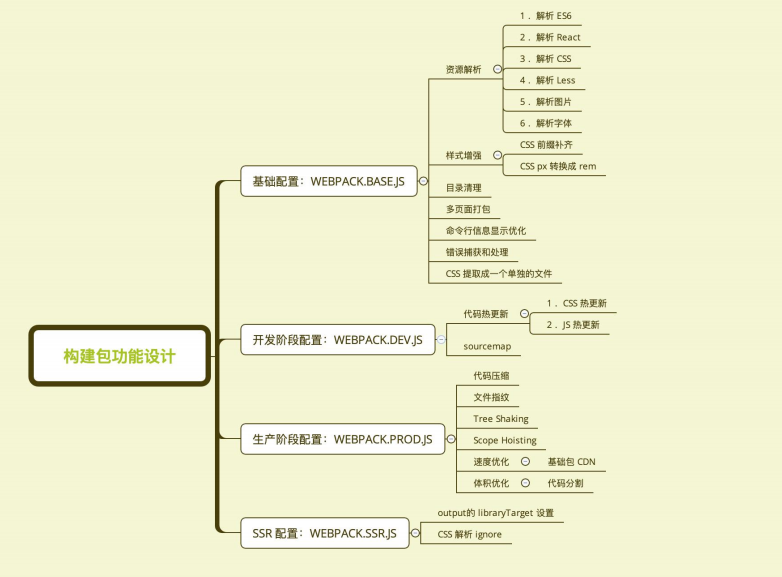

<!--
 * @Author: your name
 * @Date: 2019-12-02 10:23:09
 * @LastEditTime: 2019-12-02 14:42:10
 * @LastEditors: Please set LastEditors
 * @Description: In User Settings Edit
 * @FilePath: \6、webpack\chapter4\README.md
 -->
## 进阶篇：编写可维护的 webpack 构建配置

### 构建配置抽离成 npm 包的意义

#### 通用性
- 业务开发者无需关注构建配置 
- 统一团队构建脚本 
#### 可维护性 
- 构建配置合理的拆分 
- README 文档、ChangeLog 文档等 
#### 质量
- 冒烟测试、单元测试、测试覆盖率 
- 持续集成

### 构建配置管理的可选方案

通过多个配置文件管理不同环境的构建，webpack --config 参数进行控制 

将构建配置设计成一个库，比如：hjs-webpack、Neutrino、webpack-blocks 

抽成一个工具进行管理，比如：create-react-app, kyt, nwb 

将所有的配置放在一个文件，通过 --env 参数控制分支选择

### 构建配置包设计

通过多个配置文件管理不同环境的 webpack 配置 
- 基础配置：webpack.base.js 
- 开发环境：webpack.dev.js 
- 生产环境：webpack.prod.js 
- SSR环境：webpack.ssr.js   
……

抽离成一个 npm 包统一管理 

- 规范：Git commit日志、README、ESLint 规范、Semver 规范 
- 质量：冒烟测试、单元测试、测试覆盖率和 CI

### 通过 webpack-merge 组合配置

合并配置：module.exports = merge(baseConfig, devConfig);

### 功能模块设计



### 目录结构设计

- lib 放置源代码 
- test 放置测试代码


### 使用 ESLint 规范构建脚本

使用 eslint-config-airbnb-base 

eslint --fix 可以自动处理空格

```javascript
module.exports = { 
  "parser": "babel-eslint", 
  "extends": "airbnb-base", 
  "env": { 
    "browser": true, 
    "node": true 
    } 
};
```

### 冒烟测试 (smoke testing)

冒烟测试是指对提交测试的软件在进行详细深入的测试之前而进行的预测试，这种 预测试的主要目的是暴露导致软件需重新发布的基本功能失效等严重问题。

### 冒烟测试执行

构建是否成功 

每次构建完成 build 目录是否有内容输出 

- 是否有 JS、CSS 等静态资源文件 
- 是否有 HTML 文件

### 判断构建是否成功

在示例项目里面运行构建，看看是否有报错


### 判断基本功能是否正常

编写 mocha 测试用例 

- 是否有 JS、CSS 等静态资源文件 
- 是否有 HTML 文件


### 单元测试与测试覆盖率


### 编写单元测试用例

技术选型：Mocha + Chai 

测试代码：describe, it, except 

测试命令：mocha add.test.js

add.test.js 

```javascript
const expect = require('chai').expect; 
const add = require('../src/add'); 
describe('use expect: src/add.js', () => { 
  it('add(1, 2) === 3', () => {
     expect(add(1, 2).to.equal(3)); 
     }); 
  });
```

### 单元测试接入

1. 安装 mocha + chai npm i mocha chai -D 
   
2. 新建 test 目录，并增加 xxx.test.js 测试文件 

3. 在 package.json 中的 scripts 字段增加 test 命令 "scripts": { "test": "node_modules/mocha/bin/_mocha” }, 
   
4. 执行测试命令 npm run test

### 持续集成的作用

优点：
- 快速发现错误 
- 防止分支大幅偏离主干 

核心措施是，代码集成到主干之前，必须通 过自动化测试。只要有一个测试用例失败， 就不能集成。


### Github 最流行的 CI


### 接入 Travis CI

1. https://travis-ci.org/ 使用 GitHub 账号登录
   
2. 在 https://travis-ci.org/account/repositories 为项目开启 
   
3. 项目根目录下新增 .travis.yml

### travis.yml 文件内容

install 安装项目依赖 

script 运行测试用例


### 发布到 npm

添加用户：npm adduser

升级版本：

- 升级补丁版本号：npm version patch 
- 升级小版本号：npm version minor 
- 升级大版本号：npm version major 

发布版本：npm publish

### Git 规范和 Changelog 生成

良好的 Git commit 规范优势： 
- 加快 Code Review 的流程 
- 根据 Git Commit 的元数据生成 Changelog 
- 后续维护者可以知道 Feature 被修改的原因


### 提交格式要求


