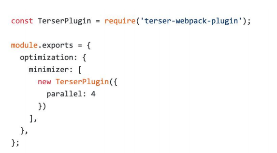
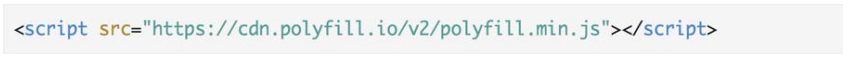

<!--
 * @Author: your name
 * @Date: 2019-12-02 14:46:03
 * @LastEditTime: 2019-12-02 15:20:41
 * @LastEditors: Please set LastEditors
 * @Description: In User Settings Edit
 * @FilePath: \6、webpack\chapter5\README.md
 -->
## webpack 构建速度和体积优化策略

### 初级分析：使用 webpack 内置的 stats

stats: 构建的统计信息

package.json 中使用 stats

### 速度分析：使用 speed-measure-webpack-plugin

代码示例

可以看到每个 loader 和插件执行耗时

### 速度分析插件作用

分析整个打包总耗时 

每个插件和loader的耗时情况

### webpack-bundle-analyzer 分析体积

代码示例

### 可以分析哪些问题？

依赖的第三方模块文件大小 

业务里面的组件代码大小

使用高版本的 webpack 和 Node.js

### 使用 webpack4：优化原因

V8 带来的优化（for of 替代 forEach、Map 和 Set 替代 Object、includes 替代 indexOf） 

默认使用更快的 md4 hash 算法 

webpacks AST 可以直接从 loader 传递给 AST，减少解析时间 

使用字符串方法替代正则表达式

### 多进程/多实例构建：资源并行解析可选方案

### 多进程/多实例：使用 HappyPack 解析资源

原理：每次 webapck 解析一个模块，HappyPack 会将它及它的依赖分配给 worker 线程中

### 多进程/多实例：使用 thread-loader 解析资源

原理：每次 webpack 解析一个模块，thread- loader 会将它及它的依赖分配给 worker 线程中

### 多进程/多实例：并行压缩

方法一：使用 parallel-uglify-plugin 插件

方法二：uglifyjs-webpack-plugin 开启 parallel 参数

方法三：terser-webpack-plugin 开启 parallel 参数

### 分包：设置 Externals

思路：将 react、react-dom 基础包通过 cdn 引入，不打入 bundle 中

方法：使用 html-webpack-externals- plugin

### 进一步分包：预编译资源模块

思路：将 react、react-dom、redux、react-redux 基础包和业务基础包打包成一个文件 

方法：使用 DLLPlugin 进行分包，DllReferencePlugin 对 manifest.json 引用

### 使用 DLLPlugin 进行分包

### 使用 DllReferencePlugin 引用 manifest.json

在 webpack.config.js 引入

引用效果

### 缓存

目的：提升二次构建速度 

缓存思路：
- babel-loader 开启缓存 
- terser-webpack-plugin 开启缓存 
- 使用 cache-loader 或者 hard-source-webpack-plugin

### 缩小构建目标

目的：尽可能的少构建模块

比如 babel-loader 不解析 node_modules

### 减少文件搜索范围

优化 resolve.modules 配置（减少模块搜索层级） 

优化 resolve.mainFields 配置 

优化 resolve.extensions 配置 合理使用 alias

要求：基于 Node 库的 imagemin 或者 tinypng API 

使用：配置 image-webpack-loader

## 图片压缩

要求：基于 Node 库的 imagemin 或者 tinypng API

使用：配置 image-webpack-loader

### Imagemin的优点分析

- 有很多定制选项 
- 可以引入更多第三方优化插件，例如pngquant 
- 可以处理多种图片格式

### Imagemin的压缩原理

- pngquant: 是一款PNG压缩器，通过将图像转换为具有alpha通道（通常比24/32位PNG 文件小60-80％）的更高效的8位PNG格式，可显著减小文件大小。 
- pngcrush:其主要目的是通过尝试不同的压缩级别和PNG过滤方法来降低PNG IDAT数据 流的大小。 
- optipng:其设计灵感来自于pngcrush。optipng可将图像文件重新压缩为更小尺寸，而不 会丢失任何信息。 
- tinypng:也是将24位png文件转化为更小有索引的8位图片，同时所有非必要的metadata 也会被剥离掉

### tree shaking(摇树优化)复习

概念：1 个模块可能有多个方法，只要其中的某个方法使用到了，则整个文件都会被打到 bundle 里面去，tree shaking 就是只把用到的方法打入 bundle ，没用到的方法会在 uglify 阶段被擦除掉

使用：webpack 默认支持，在 .babelrc 里设置 modules: false 即可。production mode的情况下默认开启

要求：必须是 ES6 的语法，CJS 的方式不支持

### 无用的 CSS 如何删除掉？

PurifyCSS: 遍历代码，识别已经用到的 CSS class

uncss: HTML 需要通过 jsdom 加载，所有的样式通过PostCSS解析，通过 document.querySelector 来识别在 html 文件里面不存在的选择器

### 在 webpack 中如何使用 PurifyCSS?

使用 purgecss-webpack-plugin 
- https://github.com/FullHuman/purgecss-webpack-plugin

和 mini-css-extract-plugin 配合使用

### 构建体积优化：动态 Polyfill

babel-polyfill 打包后体积：88.49k，占比 29.6%

### 构建体积优化：动态 Polyfill

### Polyfill Service原理

识别 User Agent，下发不同的 Polyfill

### 构建体积优化：如何使用动态 Polyfill service

polyfill.io 官方提供的服务

### 体积优化策略总结

- Scope Hoisting 
- Tree-shaking 
- 公共资源分离 
- 图片压缩 
- 动态 Polyfill

