<!--
 * @Author: your name
 * @Date: 2019-12-02 15:24:34
 * @LastEditTime: 2019-12-02 17:28:57
 * @LastEditors: Please set LastEditors
 * @Description: In User Settings Edit
 * @FilePath: \6、webpack\chapter6\README.md
 -->

## 通过源码掌握 webpack 打包原理

### 开始：从 webpack 命令行说起

通过 npm scripts 运行 webpack

- 开发环境： npm run dev
- 生产环境：npm run build

通过 webpack 直接运行

- webpack entry.js bundle.js


### 查找 webpack 入口文件

在命令行运行以上命令后，npm 会让命令行工具进入 node_modules\.bin 目录 查找是否存在 webpack.sh 或者 webpack.cmd 文件，如果存在，就执行，不 存在，就抛出错误。

实际的入口文件是：node_modules\webpack\bin\webpack.js

### 分析 webpack 的入口文件：webpack.js

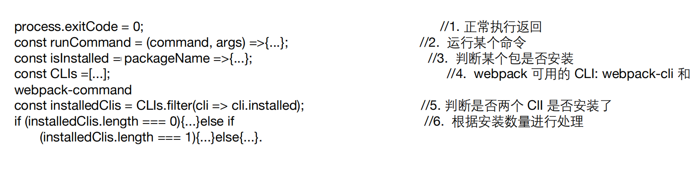

### 启动后的结果

webpack 最终找到 webpack-cli (webpack-command) 这个 npm 包，并且 执行 CLI

### webpack-cli 做的事情

引入 yargs，对命令行进行定制

分析命令行参数，对各个参数进行转换，组成编译配置项

引用 webpack，根据配置项进行编译和构建

### 从 NON_COMPILATION_CMD 分析出不需要编译的命令

webpack-cli 处理不需要经过编译的命令

```javascript
const { NON_COMPILATION_ARGS } = require("./utils/constants");
const NON_COMPILATION_CMD = process.argv.find(arg => {
  if (arg === "serve") {
    global.process.argv = global.process.argv.filter(a => a !== "serve");
    process.argv = global.process.argv;
  }
  return NON_COMPILATION_ARGS.find(a => a === arg);
});
if (NON_COMPILATION_CMD) {
  return require("./utils/prompt-command")(
    NON_COMPILATION_CMD,
    ...process.argv
  );
}
```

### NON_COMPILATION_ARGS 的内容

webpack-cli 提供的不需要编译的命令

```javascript
const NON_COMPILATION_ARGS = [
  "init", //创建一份 webpack 配置文件
  "migrate", //进行 webpack 版本迁移
  "add", //往 webpack 配置文件中增加属 性
  "remove", //往 webpack 配置文件中删除属 性
  "serve", //运行 webpack-serve
  "generate-loader", //生成 webpack loader 代码
  "generate-plugin", //生成 webpack plugin 代码
  "info" //返回与本地环境相关的一些信息
];
```

### 命令行工具包 yargs 介绍

提供命令和分组参数

动态生成 help 帮助信息

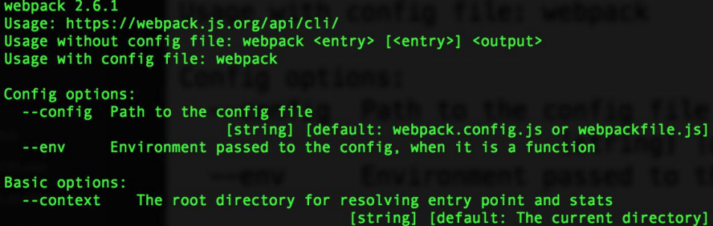

### webpack-cli 使用 args 分析

参数分组 (config/config-args.js)，将命令划分为 9 类：

- Config options: 配置相关参数(文件名称、运行环境等)
- Basic options: 基础参数(entry 设置、debug 模式设置、watch 监听设置、devtool 设置)
- Module options: 模块参数，给 loader 设置扩展
- Output options: 输出参数(输出路径、输出文件名称)
- Advanced options: 高级用法(记录设置、缓存设置、监听频率、bail 等)
- Resolving options: 解析参数(alias 和 解析的文件后缀设置)
- Optimizing options: 优化参数 ·Stats options: 统计参数
- options: 通用参数(帮助命令、版本信息等)

### webpack-cli 执行的结果

webpack-cli 对配置文件和命令行参数进行转换最终生成配置选项参数 options 最终会根据配置参数实例化 webpack 对象，然后执行构建流程

### Webpack 的本质

Webpack 可以将其理解是一种基于事件流的编程范例，一系列的插件运行。

### 先看一段代码

核心对象 Compiler 继承 Tapable

```javascript
class Compiler extends Tapable { // ... }
```

核心对象 Compilation 继承 Tapable

```javascript
class Compilation extends Tapable { // ... }
```

### Tapable 是什么？

Tapable 是一个类似于 Node.js 的 EventEmitter 的库, 主要是控制钩子函数的发布 与订阅,控制着 webpack 的插件系统。

Tapable 库暴露了很多 Hook（钩子）类，为插件提供挂载的钩子

```javascript
const {
  SyncHook, //同步钩子
  SyncBailHook, //同步熔断钩子
  SyncWaterfallHook, //同步流水钩子
  SyncLoopHook, //同步循环钩子
  AsyncParallelHook, //异步并发钩子
  AsyncParallelBailHook, //异步并发熔断钩子
  AsyncSeriesHook, //异步串行钩子
  AsyncSeriesBailHook, //异步串行熔断钩子
  AsyncSeriesWaterfallHook //异步串行流水钩子
} = require("tapable");
```

### Tapable hooks 类型

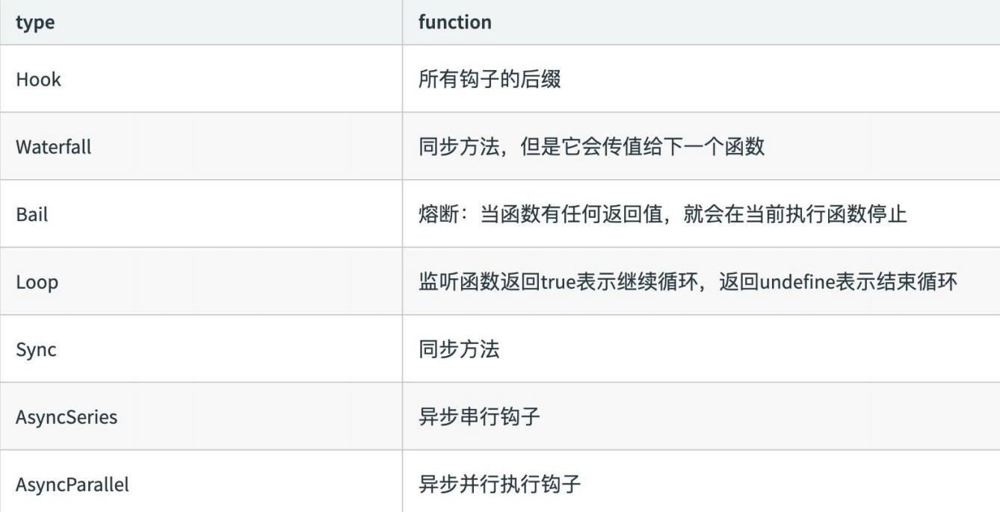

### Tapable 的使用 -new Hook 新建钩子

Tapable 暴露出来的都是类方法，new 一个类方法获得我们需要的钩子

class 接受数组参数 options ，非必传。类方法会根据传参，接受同样数量的参数。

```javascript
const hook1 = new SyncHook(["arg1", "arg2", "arg3"]);
```

### Tapable 的使用-钩子的绑定与执行

Tabpack 提供了同步&异步绑定钩子的方法，并且他们都有绑定事件和执行事件对 应的方法。

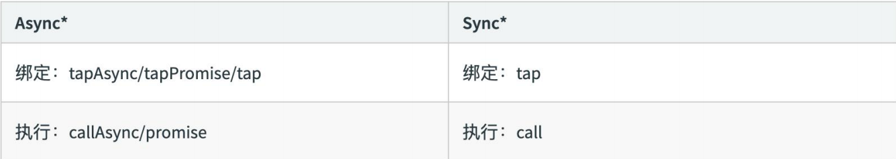

### Tapable 的使用-hook 基本用法示例

```javascript
const hook1 = new SyncHook(["arg1", "arg2", "arg3"]); //绑定事件到webapck事件流
hook1.tap("hook1", (arg1, arg2, arg3) => console.log(arg1, arg2, arg3)); //1,2,3 //执行绑定的事件 hook1.call(1,2,3)
```

### Tapable 的使用-实际例子演示

定义一个 Car 方法，在内部 hooks 上新建钩子。分别是同步钩子 accelerate、 brake（ accelerate 接受一个参数）、异步钩子 calculateRoutes

使用钩子对应的绑定和执行方法

calculateRoutes 使用 tapPromise 可以返回一个 promise 对象

### Tapable 是如何和 webpack 联系起来的？

```javascript
if (Array.isArray(options)) {
  compiler = new MultiCompiler(options.map(options => webpack(options)));
} else if (typeof options === "object") {
  options = new WebpackOptionsDefaulter().process(options);
  compiler = new Compiler(options.context);
  compiler.options = options;
  new NodeEnvironmentPlugin().apply(compiler);
  if (options.plugins && Array.isArray(options.plugins)) {
    for (const plugin of options.plugins) {
      if (typeof plugin === "function") {
        plugin.call(compiler, compiler);
      } else {
        plugin.apply(compiler);
      }
    }
  }
  compiler.hooks.environment.call();
  compiler.hooks.afterEnvironment.call();
  compiler.options = new WebpackOptionsApply().process(options, compiler);
}
```

### 模拟 Compiler.js

```javascript
module.exports = class Compiler {
  constructor() {
    this.hooks = {
      accelerate: new SyncHook(["newspeed"]),
      brake: new SyncHook(),
      calculateRoutes: new AsyncSeriesHook(["source", "target", "routesList"])
    };
  }
  run() {
    this.accelerate(10);
    this.break();
    this.calculateRoutes("Async", "hook", "demo");
  }
  accelerate(speed) {
    this.hooks.accelerate.call(speed);
  }
  break() {
    this.hooks.brake.call();
  }
  calculateRoutes() {
    this.hooks.calculateRoutes.promise(...arguments).then(
      () => {},
      err => {
        console.error(err);
      }
    );
  }
};
```

### 插件 my-plugin.js

```javascript
const Compiler = require("./Compiler");
class MyPlugin {
  constructor() {}
  apply(compiler) {
    compiler.hooks.brake.tap("WarningLampPlugin", () =>
      console.log("WarningLampPlugin")
    );
    compiler.hooks.accelerate.tap("LoggerPlugin", newSpeed =>
      console.log(`Accelerating to ${newSpeed}`)
    );
    compiler.hooks.calculateRoutes.tapPromise(
      "calculateRoutes tapAsync",
      (source, target, routesList) => {
        return new Promise((resolve, reject) => {
          setTimeout(() => {
            console.log(`tapPromise to ${source} ${target} ${routesList}`);
            resolve();
          }, 1000);
        });
      }
    );
  }
}
```

### 模拟插件执行

```javascript
const myPlugin = new MyPlugin();
const options = { plugins: [myPlugin] };
const compiler = new Compiler();
for (const plugin of options.plugins) {
  if (typeof plugin === "function") {
    plugin.call(compiler, compiler);
  } else {
    plugin.apply(compiler);
  }
}
compiler.run();
```

### Webpack 流程篇

webpack的编译都按照下面的钩子调用顺序执行

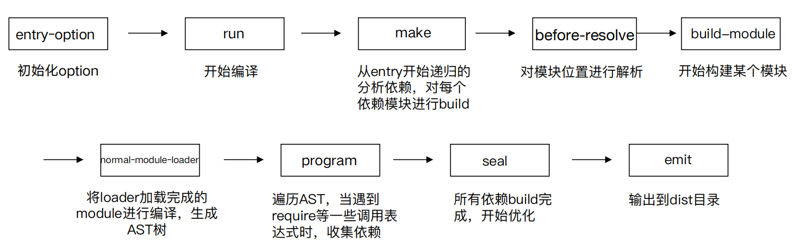

### WebpackOptionsApply

将所有的配置 options 参数转换成 webpack 内部插件 使用默认插件列表

举例：

- output.library -> LibraryTemplatePlugin 
- externals -> ExternalsPlugin 
- devtool -> EvalDevtoolModulePlugin, SourceMapDevToolPlugin 
- AMDPlugin, CommonJsPlugin 
- RemoveEmptyChunksPlugin

### Compiler hooks

流程相关： 
- (before-)run 
- (before-/after-)compile 
- make 
- (after-)emit 
- done 
监听相关： 
- watch-run 
- watch-close

### Compilation

Compiler 调用 Compilation 生命周期方法

- addEntry -> addModuleChain 
- finish (上报模块错误) 
- seal

### ModuleFactory

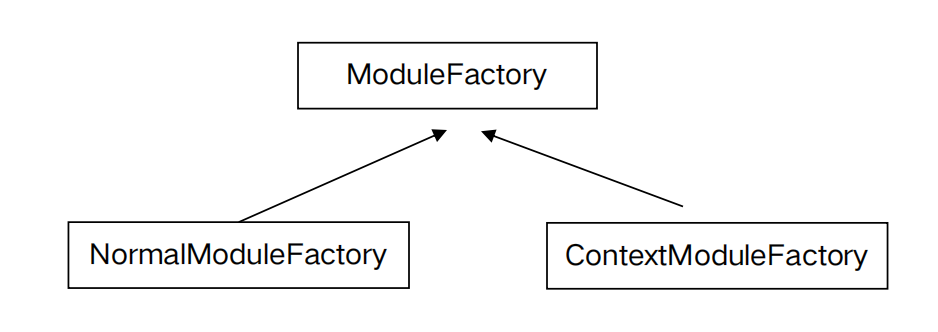

### Module

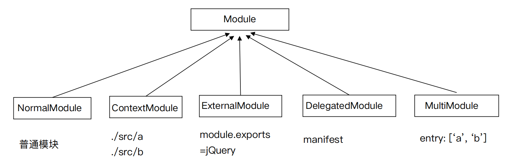

### NormalModule

Build

- 使用 loader-runner 运行 loaders 
- 通过 Parser 解析 (内部是 acron) 
- ParserPlugins 添加依赖

### Compilation hooks

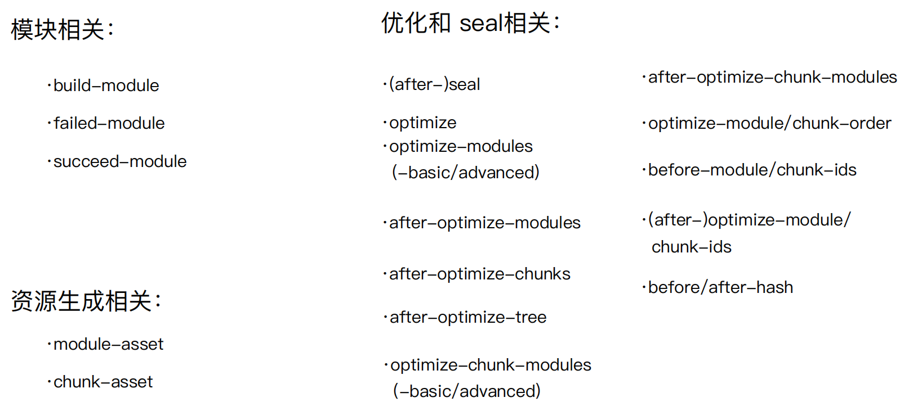

### Chunk 生成算法

1. webpack 先将 entry 中对应的 module 都生成一个新的 chunk 
2. 遍历 module 的依赖列表，将依赖的 module 也加入到 chunk 中 
3. 如果一个依赖 module 是动态引入的模块，那么就会根据这个 module 创建一个 新的 chunk，继续遍历依赖 
4. 重复上面的过程，直至得到所有的 chunks

### 模块化：增强代码可读性和维护性

- 传统的网页开发转变成 Web Apps 开发 
- 代码复杂度在逐步增高 
- 分离的 JS文件/模块，便于后续代码的维护性 
- 部署时希望把代码优化成几个 HTTP 请求

### 常见的几种模块化方式

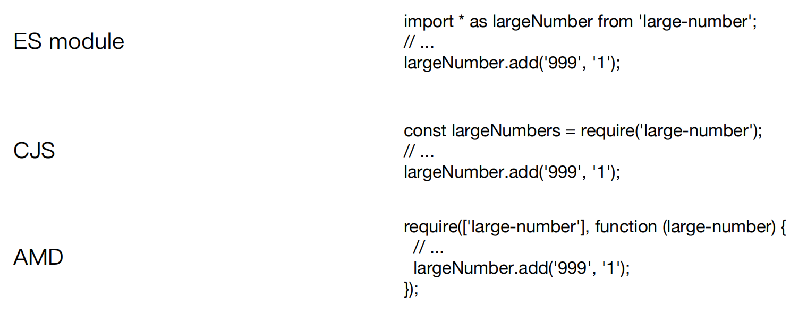

### AST 基础知识

抽象语法树（abstract syntax tree 或者缩写为 AST），或者语法树（syntax tree），是 源代码的抽象语法结构的树状表现形式，这里特指编程语言的源代码。树上的每个节点都 表示源代码中的一种结构。

在线demo: https://esprima.org/demo/parse.html

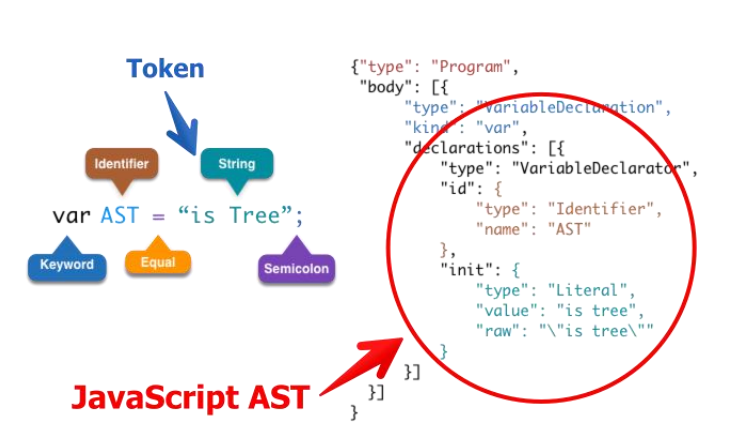

### 复习一下 webpack 的模块机制

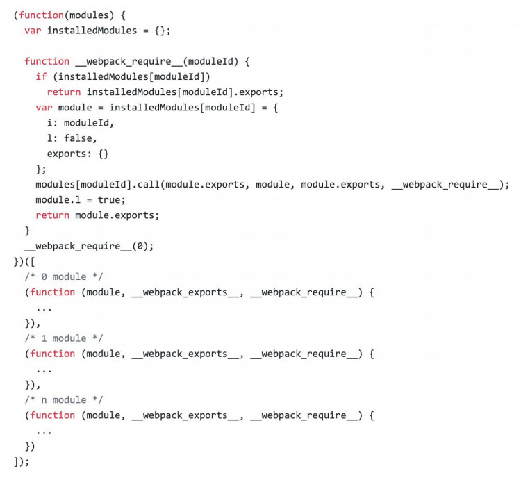

- 打包出来的是一个 IIFE (匿名闭包) 
- modules 是一个数组，每一项是一个模块初始化函数 
- __webpack_require 用来加载模块，返回 module.exports 
- 通过 WEBPACK_REQUIRE_METHOD(0) 启动程序

### 动手实现一个简易的 webpack

可以将 ES6 语法转换成 ES5 的语法 

- 通过 babylon 生成AST 
- 通过 babel-core 将AST重新生成源码 

可以分析模块之间的依赖关系 
- 通过 babel-traverse 的 ImportDeclaration 方法获取依赖属性 

生成的 JS 文件可以在浏览器中运行